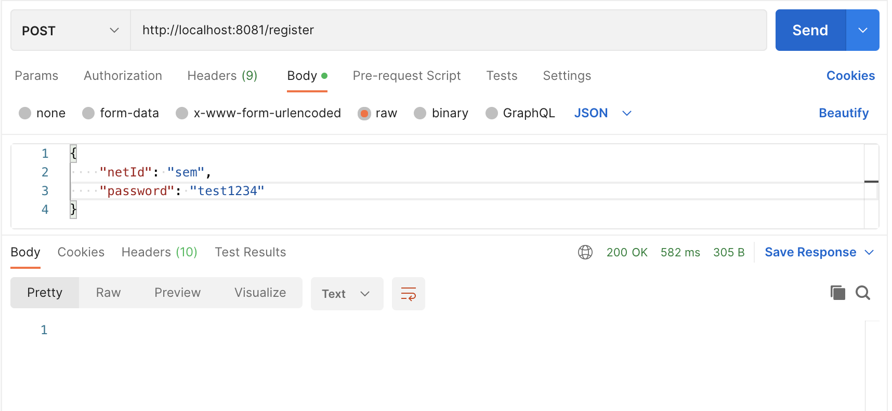

# HR Management

## Port map

| Port | Service                   |
|------|---------------------------|
| 8080 | API gateway               |
| 8081 | Authentication            |
| 8082 | User                      |
| 8083 | Contract                  |
| 8084 | Request                   |
| 8085 | Notification              |
| 8761 | Service registry (Eureka) |

## Running the microservices

You can run the two microservices individually by starting the Spring applications. Then, you can use *Postman* to perform the different requests:

Register:

Authenticate:

Hello:

